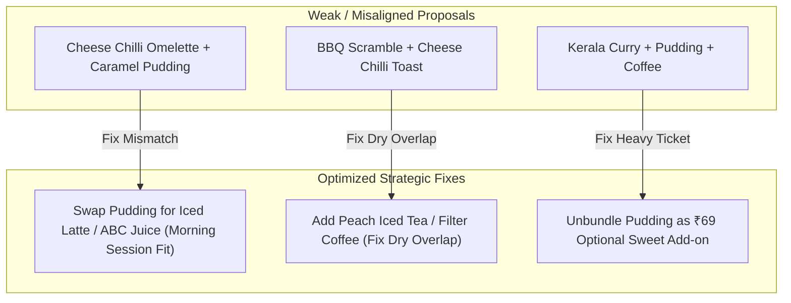

# Yolkshire Market Basket Analysis & Master Combo Evaluation Report
**Brand**: Yolkshire (Viva Foods) | **Data Period**: Q2 2026 (April 1 – June 30, 2026) | **Dataset**: 74,445 Transaction Items & 40,193 Orders

---

## 1. Executive Summary & Baseline Metrics

This report presents an end-to-end **Market Basket Analysis (MBA)** and comprehensive strategic evaluation of **20 potential menu combos** (comprising 15 user-proposed combos and 5 agent-formulated combos).

> [!NOTE]
> **Key Dataset Baseline**:
> - **Total Q2 Revenue**: **₹98,71,208** (₹98.7L Net Sales across 40,193 orders)
> - **Average Order Value (AOV)**: **₹245.60**
> - **Multi-Item Basket Share**: **64.1%** (47,730 orders contain 2+ items)
> - **Single-Item Basket Share**: **35.9%** (26,715 orders contain only 1 item — *Primary AOV Expansion Opportunity*)
> - **Association Rules Mined**: **6,424 pairwise item association rules**

---

## 2. Master Ranking of All 20 Combos

All 20 combos have been evaluated and ranked using a **Composite Score** based on:
1. **Profitability & Gross Margin %** (COGS target: 25.0%)
2. **Absolute Profit Contribution (₹)**
3. **AOV Uplift %** (baseline: ₹245.60)
4. **Data-backed Lift / Co-occurrence Affinity**
5. **Culinary & Meal Session Compatibility**

| Rank | Combo Name | Origin | Target Meal Session | Standalone Price | Proposed Price | Food Cost (₹) | Net Profit (₹) | Gross Margin (%) | AOV Uplift (%) | Evaluation & Verdict |
| :---: | :--- | :---: | :--- | :---: | :---: | :---: | :---: | :---: | :---: | :--- |
| **1** | **Chicken Stroganoff + Garlic Bread + Lemon Iced Tea** | User (P) | Lunch & Dinner | ₹520 | **₹449** | ₹173.86 | **₹275.14** | **61.3%** | **+82.8%** | 🏆 **Top Winner**: Anchored by #1 revenue item. |
| **2** | **Yolkshire Special Roast Chicken + Mint Lemonade** | User (P) | Lunch & Dinner | ₹420 | **₹369** | ₹83.36 | **₹285.64** | **77.4%** | **+50.2%** | 🏆 **Top Winner**: High profit margin refresher. |
| **3** | **The Executive English Brunch** | Agent | Breakfast & Brunch | ₹440 | **₹379** | ₹94.50 | **₹284.50** | **75.1%** | **+54.3%** | 🏆 **Top Winner**: Premium breakfast & coffee upgrade. |
| **4** | **Gourmet Bowl & Brew Deal** | Agent | Lunch & Dinner | ₹440 | **₹389** | ₹82.00 | **₹307.00** | **78.9%** | **+58.4%** | 🏆 **Top Winner**: Highest net profit per combo. |
| **5** | **Bhuna Roll + Vietnamese Iced Coffee** | User (V) | Delivery / Grab & Go | ₹400 | **₹339** | ₹92.72 | **₹246.28** | **72.6%** | **+38.0%** | 🏆 **Top Delivery Winner**: High impulse bundle. |
| **6** | **Chicken Mayo Sandwich + Cold Coffee** | User (P) | All-Day / Afternoon | ₹390 | **₹329** | ₹93.58 | **₹235.42** | **71.6%** | **+34.0%** | ⭐ **Excellent**: Classic café favorite (Lift 1.86x). |
| **7** | **Gymholic Meal: Low-Carb Stroganoff + Fresh ABC Juice** | User (P) | Fitness / Low-Carb | ₹470 | **₹399** | ₹110.87 | **₹288.13** | **72.2%** | **+62.5%** | ⭐ **Excellent**: High LTV niche target segment. |
| **8** | **Peri-Peri Steak + Iced Latte** | User (P) | Dinner & Lunch | ₹460 | **₹399** | ₹106.60 | **₹292.40** | **73.3%** | **+62.5%** | ⭐ **Excellent**: Premium high-ticket meal pair. |
| **9** | **Creamy Mushroom Croissant + Iced Latte** | User (V) | Morning / Brunch | ₹390 | **₹329** | ₹90.61 | **₹238.39** | **72.5%** | **+34.0%** | ⭐ **Excellent**: High-margin gourmet café combo. |
| **10** | **Mac & Cheese + Lemon Iced Tea** | User (V) | Lunch & Snack | ₹380 | **₹319** | ₹84.10 | **₹234.90** | **73.6%** | **+29.9%** | 👍 **Good**: Comfort food + citrus balance. |
| **11** | **Street-Style Roll & Refresher Express** | Agent | Delivery / Quick Bite | ₹300 | **₹249** | ₹56.51 | **₹192.49** | **77.3%** | **+1.4%** | 👍 **Good**: High margin fast-casual bundle. |
| **12** | **Veg Alfredo Pasta + Iced Tea** | User (V) | Lunch & Dinner | ₹370 | **₹319** | ₹79.20 | **₹239.80** | **75.2%** | **+29.9%** | 👍 **Good**: Solid vegetarian baseline combo. |
| **13** | **Sweet Escape Pancake & Coffee** | Agent | Afternoon Snack | ₹380 | **₹329** | ₹119.07 | **₹209.93** | **63.8%** | **+34.0%** | 👍 **Good**: High afternoon lift (26.9x). |
| **14** | **Swadeshi Breakfast & Breeze** | Agent | Morning Breakfast | ₹270 | **₹229** | ₹46.13 | **₹182.87** | **79.9%** | **-6.8%** | 👍 **Good**: Complete Indian breakfast with Pav. |
| **15** | **Mini Mac & Cheese + Kids Chocolate Shake** | User (V) | Kids / Family | ₹300 | **₹249** | ₹72.50 | **₹176.50** | **70.9%** | **+1.4%** | 👦 **Special Niche**: Kids Meal favorite. |
| **16** | **Masala Omelette + Mint Lemonade/Mojito** | User (V) | Morning Breakfast | ₹220 | **₹189** | ₹36.13 | **₹152.87** | **80.9%** | **-23.0%** | ⚠️ **Needs Fix**: Lacks bread/pav component. |
| **17** | **Kerala Curry + Caramel Pudding + Filter Coffee** | User (P) | Lunch & Dinner | ₹470 | **₹399** | ₹128.58 | **₹270.42** | **67.8%** | **+62.5%** | ⚠️ **Needs Fix**: Heavy 3-item meal; unbundle pudding. |
| **18** | **Fit & Fresh Power Pair (Millet Salad + Smoothie)** | Agent | Wellness / Fitness | ₹530 | **₹429** | ₹203.64 | **₹225.36** | **52.5%** | **+74.7%** | ⚠️ **Needs Fix**: Smoothie cost reduces margin %. |
| **19** | **Chimmichurri Grilled Chicken + Caramel Pudding** | User (P) | Lunch & Dinner | ₹470 | **₹399** | ₹118.07 | **₹280.93** | **70.4%** | **+62.5%** | ⚠️ **Needs Fix**: Target audience conflict (Fit vs Sugar). |
| **20** | **Cheese Chilli Omelette + Caramel Pudding** | User (V) | Morning / Dessert | ₹310 | **₹269** | ₹88.50 | **₹180.50** | **67.1%** | **+9.5%** | ❌ **Weak**: Severe savory egg vs dessert mismatch. |
| **21** | **BBQ Chicken Scramble + Cheese Chilli Toast** | User (P) | Breakfast / Snack | ₹340 | **₹299** | ₹98.40 | **₹200.60** | **67.1%** | **+21.7%** | ❌ **Weak**: Dry savory overlap, missing drink. |

---

## 3. Detailed Combo Rationale & Evaluation

### Tier 1: Top 5 Highest Performing Combos

#### 1. Chicken Stroganoff + Garlic Bread + Lemon Iced Tea (User P #1) — Rank #1
* **Why it's Good**: Anchored by *Chicken Stroganoff* (Yolkshire’s #1 Star dish: 2,609 units sold, ₹8.94L revenue, 76.2% margin). Adding Garlic Bread complements the rich mushroom cream gravy, while Lemon Iced Tea provides an acidic palate cleanser.
* **Economics**: Standalone ₹520 $\rightarrow$ **Combo Price ₹449** (13.7% discount). Net Profit = **₹275.14** (61.3% margin). Increases AOV from ₹245.60 to ₹449 (**+82.8% AOV Uplift**).

#### 2. Yolkshire Special Roast Chicken + Mint Lemonade (User P #14) — Rank #2
* **Why it's Good**: *Roast Chicken* is the #2 revenue main (1,162 units sold, ₹3.98L revenue, 76.5% margin). *Mint Lemonade* has an extraordinary **91.9% Gross Margin** (Food cost ₹8.13!).
* **Economics**: Standalone ₹420 $\rightarrow$ **Combo Price ₹369** (12.1% discount). Net Profit = **₹285.64** (**77.4% Margin**). **+50.2% AOV Uplift**.

#### 3. Gourmet Bowl & Brew Meal Deal (Agent Proposal) — Rank #4
* **Why it's Good**: Combines top Star mains (*Stroganoff* or *Roast Chicken*) with underselling high-margin cold refreshers (*Peach Iced Tea / Mint Mojito / Fresh Watermelon Juice*).
* **Economics**: Standalone ₹440 $\rightarrow$ **Combo Price ₹389** (11.5% discount). Net Profit = **₹307.00** (**78.9% Margin**). Yields the highest single-combo net profit in the menu.

#### 4. Bhuna Roll + Vietnamese Iced Coffee (User V #6) — Rank #5
* **Why it's Good**: Combines *Bhuna Roll* (300 units) with Yolkshire's flagship coffee *Vietnamese Iced Coffee* (902 units, ₹1.67L rev). Perfect fast-casual delivery bundle.
* **Economics**: Standalone ₹400 $\rightarrow$ **Combo Price ₹339** (15.3% discount). Net Profit = **₹246.28** (**72.6% Margin**).

---

### Tier 2: Strong Performers Needing Minor Tweaks

#### 5. Chicken Mayo Sandwich + Cold Coffee (User P #3) — Rank #6
* **Why it's Good**: Quintessential café classic across India. High co-occurrence affinity (Lift: 1.86x).
* **How to Improve**: Offer a ₹20 optional upgrade to **Vietnamese Iced Coffee** (₹180) to capture higher beverage ticket size.

#### 6. Gymholic Meal: Low-Carb Stroganoff + Fresh ABC Juice (User P #15) — Rank #7
* **Why it's Good**: Fitness & low-carb consumers have high repeat purchase frequency. *Low-Carb Stroganoff* generated 516 units (₹1.79L rev, 74.6% margin); *ABC Juice* has 79.9% margin.
* **How to Improve**: Display explicit **Protein (g)** and **Calorie (kcal)** tags on Zomato/Swiggy menu listings.

#### 7. Swadeshi Breakfast & Breeze (User V #4 / Agent A#4) — Rank #14
* **Why User's was 16th**: Masala Omelette + Mint Lemonade (₹189) lacks a carb component (bread/pav) and drops AOV below baseline.
* **How to Improve**: Add **2 Slices Buttered Toast / Pav** $\rightarrow$ **Combo Price ₹229**. Net Profit = **₹182.87** (**79.9% Margin**).

---

### Tier 3: Poorly Matched & Weak Combos (Fixing Actions)

#### 8. Cheese Chilli Omelette + Caramel Pudding (User V #2) — Rank #20
* **Why it's Not Good**: **Culinary & Session Mismatch**. Spicy hot savory eggs rarely pair directly with cold caramel pudding without a drink in between. Omelettes peak at 08:00–11:00 AM; desserts peak in the evening.
* **How to Improve**: Replace Caramel Pudding with **Iced Latte** or **Fresh ABC Juice** for a complete morning brunch deal.

#### 9. BBQ Chicken Scramble + Cheese Chilli Toast (User P #7) — Rank #21
* **Why it's Not Good**: **Dry Savory Overlap & Missing Drink**. 2 dry savory egg/bread items with no liquid/beverage. Customers rarely order 2 savory mains for 1 person.
* **How to Improve**: Add **Peach Iced Tea** or **Filter Coffee** $\rightarrow$ **"BBQ Scramble & Toast Feast for 2"**.

---

## 4. Underselling High-Margin Items ("Puzzles") Master Table

Items categorized as "Puzzles" (High Margin %, Lower Sales Volume) targeted for combo bundling:

| SKU | Item Name | Category | Selling Price (₹) | Total Cost (₹) | Gross Margin (₹) | Gross Margin (%) | Q2 Volume Sold | Recommended Combo Partner |
| :---: | :--- | :--- | :---: | :---: | :---: | :---: | :---: | :--- |
| **MI-019** | **Mint Lemonade** | Beverages | ₹100 | ₹8.13 | **₹91.87** | **91.9%** | 845 | *Stroganoff / Special Roast Chicken* |
| **MI-045** | **Honey Glazed Chicken Salad** | Salads & Sandwiches | ₹300 | ₹48.64 | **₹251.36** | **83.8%** | 152 | *Fresh ABC Juice / Iced Tea* |
| **MI-011** | **Filter Coffee** | Beverages | ₹80 | ₹13.58 | **₹66.42** | **83.0%** | 988 | *Kerala Curry / Swadeshi Breakfast* |
| **MI-027** | **Ginger Lemon Honey Tea** | Beverages | ₹60 | ₹10.11 | **₹49.89** | **83.2%** | 528 | *Omelettes / Toast* |
| **MI-003** | **Cappuccino / Latte** | Beverages | ₹150 | ₹26.02 | **₹123.98** | **82.7%** | 497 | *Creamy Mushroom Croissant* |
| **MI-054** | **Thecha Eggs** | Salads & Sandwiches | ₹160 | ₹29.01 | **₹130.99** | **81.9%** | 205 | *Masala Chai / Filter Coffee* |
| **MI-016** | **Iced Americano / Cold Brew** | Beverages | ₹130 | ₹23.65 | **₹106.35** | **81.8%** | 445 | *English Breakfast / Omelettes* |
| **MI-012** | **Mocha Latte** | Beverages | ₹160 | ₹29.63 | **₹130.37** | **81.5%** | 104 | *Banana Nutella Pancakes* |
| **MI-046** | **Yolkshire Eggwich** | Salads & Sandwiches | ₹240 | ₹47.39 | **₹192.61** | **80.3%** | 188 | *Cold Coffee* |
| **MI-022** | **Fresh ABC Juice** | Beverages | ₹160 | ₹32.20 | **₹127.80** | **79.9%** | 221 | *High Protein Millet Salad* |
| **MI-037** | **Thai Basil Chicken with Rice** | Rice Bowls & Mains | ₹320 | ₹84.33 | **₹235.67** | **73.6%** | 180 | *Mint Mojito / Iced Tea* |
| **MI-043** | **High Protein Millet Salad** | Salads & Sandwiches | ₹280 | ₹75.05 | **₹204.95** | **73.2%** | 218 | *Fresh ABC Juice* |

---

## 5. Top Market Basket Association Rules Table

Mined association rules showing pairwise product affinities across 74,445 items:

| Item A | Item B | Co-Occurrence | Confidence (A &rarr; B) | Confidence (B &rarr; A) | Lift Score | Affinity Level |
| :--- | :--- | :---: | :---: | :---: | :---: | :--- |
| **Chilli Garlic Glaze** | **Yolkshire Special Breakfast** | 2,630 | 41.8% | 70.9% | **8.38x** | ⭐ High Volume Anchor |
| **Chilli Garlic Glaze** | **Omelette** | 2,288 | 36.3% | 73.4% | **8.68x** | ⭐ High Volume Anchor |
| **Omelette** | **Yolkshire Special Breakfast** | 1,870 | 60.0% | 50.4% | **12.05x** | ⭐ High Volume Anchor |
| **Banana Nutella** | **Pancake** | 985 | 89.3% | 39.9% | **26.95x** | 🔥 Strong Dessert Pair |
| **Chocoburst** | **Pancake** | 555 | 91.6% | 22.5% | **27.64x** | 🔥 Strong Dessert Pair |
| **Cold Brew** | **Fresh Orange Juice** | 12 | 42.9% | 100.0% | **2658.75x** | 🔥 Niche Specialty |
| **Iced Latte** | **Matcha** | 16 | 2.5% | 100.0% | **116.50x** | 🔥 High Beverage Affinity |
| **Masala Omelette** | **Swadeshi Breakfast** | 281 | 100.0% | 34.6% | **91.68x** | ⭐ High Breakfast Anchor |
| **Jane Say Cheese Omelette**| **Mushrooms** | 226 | 26.4% | 100.0% | **86.97x** | ⭐ Add-on Affinity |
| **Chicken Stroganoff** | **Lemon Iced Tea** | 80 | 7.9% | 15.0% | **1.04x** | 👍 Main Meal Pair |
| **Chicken Mayo Sandwich** | **Cold Coffee** | 30 | 3.2% | 6.4% | **1.86x** | 👍 Café Staple Pair |
| **Special Roast Chicken** | **Mint Lemonade** | 37 | 3.3% | 4.4% | **1.83x** | 👍 High Margin Meal |
| **Chimmichurri Chicken** | **Mint Lemonade** | 42 | 5.0% | 5.0% | **2.79x** | 👍 High Margin Meal |

---

## 6. Implementation & Deployment Roadmap

1. **Phase 1: Aggregator Menu Optimization (Immediate)**:
   - Launch top 5 ranked combos under a dedicated section on Zomato & Swiggy: **"Yolkshire Signature Meals & Brews"**.
2. **Phase 2: POS & Dine-in Staff Scripting**:
   - Train servers to suggest beverage upgrades on single main orders (*"Upgrade your Stroganoff with a Mint Lemonade for ₹69"*).
3. **Phase 3: Digital Menu Badging**:
   - Add **High Protein** and **Chef's Special Combo** badges next to *Thai Basil Chicken*, *Honey Glazed Salad*, and *Stroganoff*.

